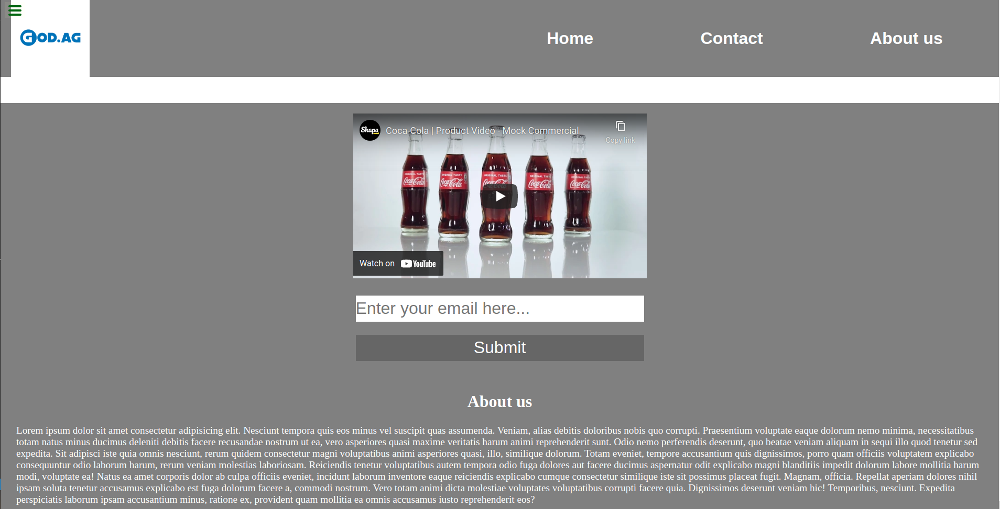

# FCC-Landing_page

> First landing page created as per the user story provided on the FCC.

First landing page as for the practice sessions given on the FCC page regarding Responsive Web Design.

## Built With

- HTML & CSS
- None
- VS Code Linters

## Live Demo

[Live Demo Link](https://raovikrant82.github.io/FCC-Landing_page/)

## Authors

👤 **Author**

- GitHub: [@raovikrant82](https://github.com/raovikrant82)
- Twitter: [@Imvikrantrao](https://twitter.com/Imvikrantrao)

## 🤝 Contributing

Contributions, issues, and feature requests are welcome!

Feel free to check the [issues page](../../issues/).

## Show your support

Give a ⭐️ if you like this project!

## 📝 License

This project is [MIT](./MIT.md) licensed.
